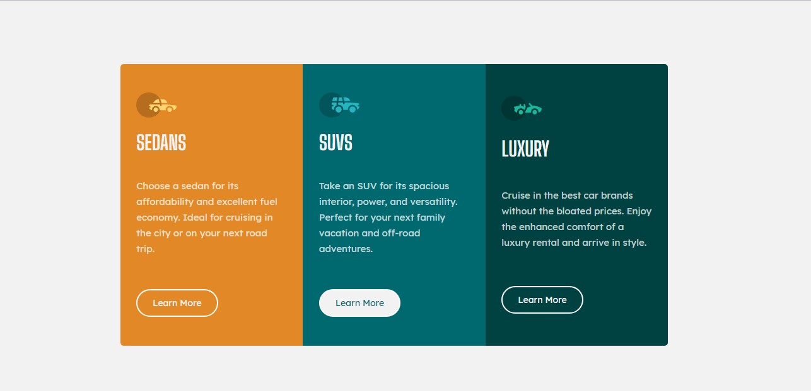

# Frontend Mentor - 3-column preview card component solution

This is a solution to the [3-column preview card component challenge on Frontend Mentor](https://www.frontendmentor.io/challenges/3column-preview-card-component-pH92eAR2-). 

## Table of contents

- [Overview](#overview)
  - [The challenge](#the-challenge)
  - [Screenshot](#screenshot)
  - [Links](#links)
  - [Built with](#built-with)
  - [What I learned](#what-i-learned)
  - [Useful resources](#useful-resources)
- [Author](#author)

## Overview

### The challenge

Users should be able to:

- View the optimal layout depending on their device's screen size
- See hover states for interactive elements

### Screenshot
- screenshots for screen sizes

### Links

- Live Site URL: [Live Site ---->](https://naughty-euler-750ea8.netlify.app)

### Built with

- Semantic HTML5 markup
- CSS custom properties
- Flexbox
- Mobile-first workflow

### What I learned
I learnt lot of things from this challange.

### Useful resources

- [w3schools](https://www.w3schools.com) - This helped me lot more for completing this project. I really liked this pattern and will use it going forward.
- [tutorials-point](https://www.tutorialspoint.com) - This is an amazing article which helped me finally understand everything. I'd recommend it to anyone still learning this all concept.

## Author

- Frontend Mentor - [@Sandesh4141](https://www.frontendmentor.io/profile/Sandesh4141)
- Twitter - [@sandesh-sp](https://www.twitter.com/@Sandesh32971351)
- Instagram - [@sandesh.sp41](https://www.instagram.com/sandesh.sp41)

